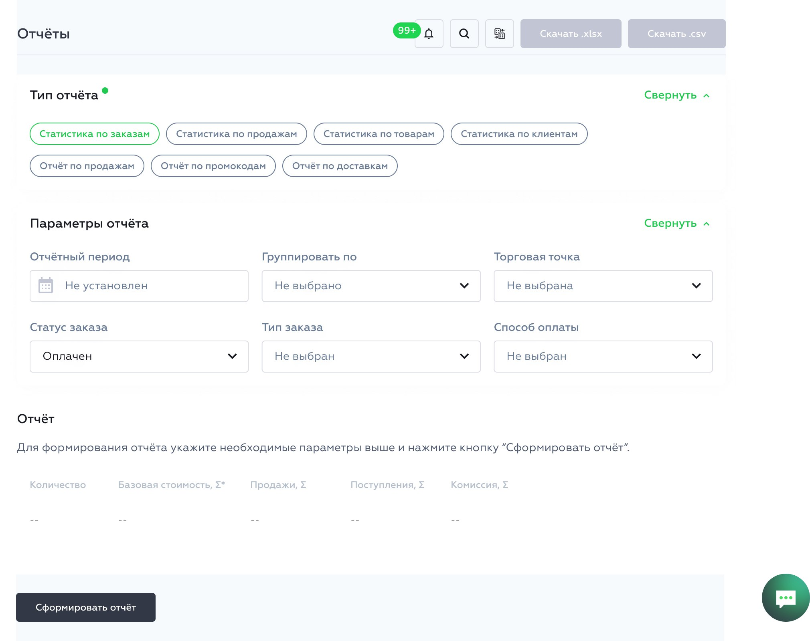
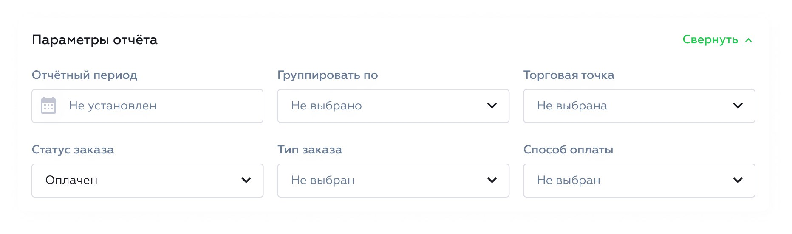
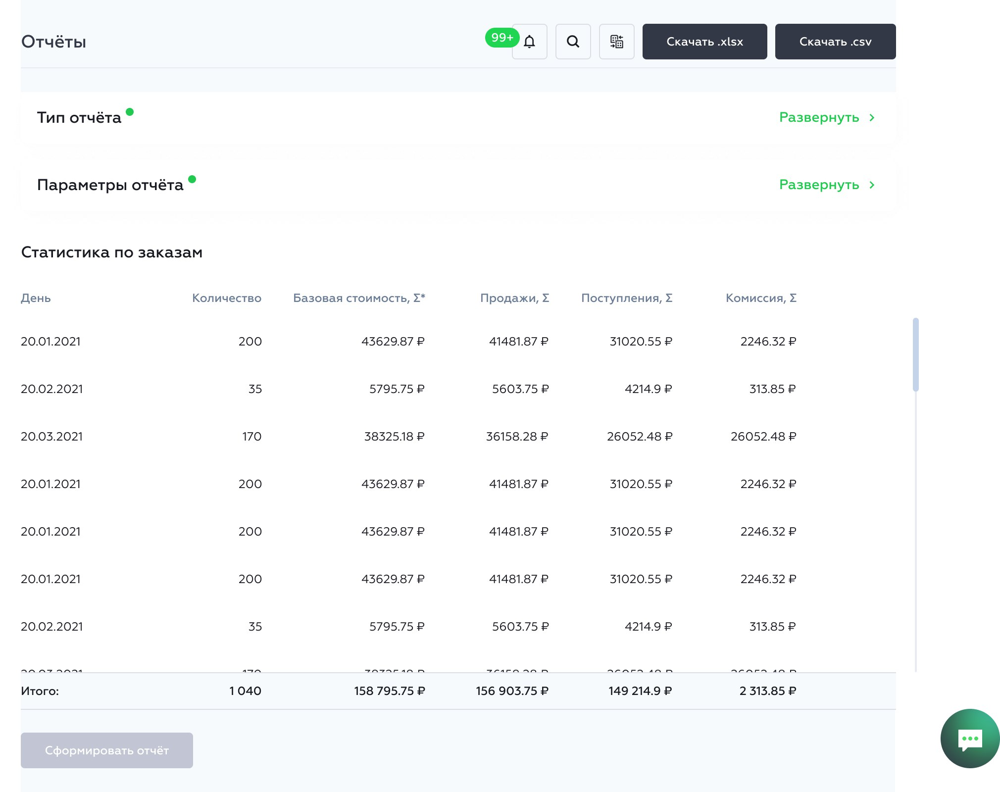
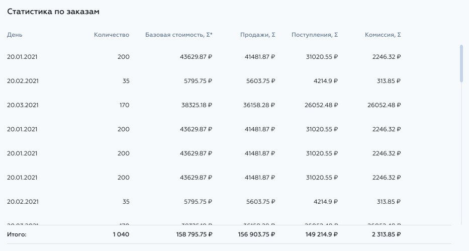

# Main description of New Reports

Here we will cover the main process of selecting, configuring, generating and downloading a report, step by step.

## Report Selection and Configuration

First, we are greeted by this screen:

We need to select a report type:

Then, we need to configure the report parameters:

## Report Generation and Download

When that's done, we are ready to generate the report:

The report is generated and shown in a table like this:

With a generated report, we can download it:

