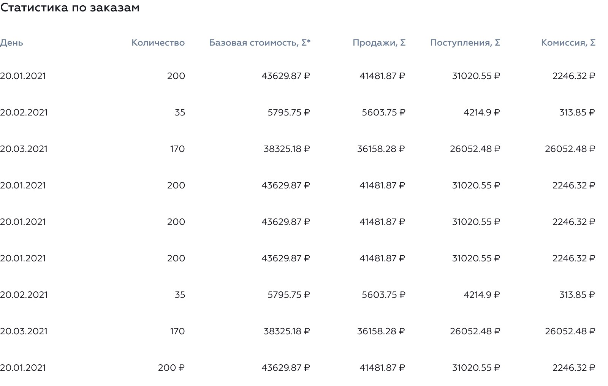
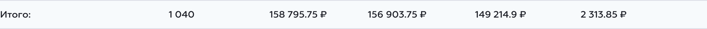

# Report Generation and Display

When the report type is selected, and its parameters are configured, the user can generate the report.  
He will need to get a table like this one:


To generate the report data, you will first need to determine which parameters to use for its generation.  
To get the report generation parameters, call this endpoint:

Method: `GET`  
Endpoint: `/api/company/v2/dashboard/reports/orders/get-report-config`

You will get a response like this one:

```Hack
shape(
    // A dictionary with the Fetch Parameters that need to be sent for each
    // report type
    'fetch_parameters' => array<
        // The report type as the key
        string,
        
        // The fetch parameters as the value
        shape(
            // The columns of the report
            'fields' => array<string, string>,

            // The filters/parameters for the report.
            // Some of them may be constant, and others may need to be
            // configured by the Report Parameters that the user has configured.
            'filters' => array<string, array>,
        
            ...,
        ),     
    >,

    ...,
)
```

For example, you will get this response:

```json5
{
  fetch_parameters: {
    promocodes_report: {
      fields: {
        hash_id: 'hash_id',
        store_id: 'store_id',
        total_base_amount: 'total_base_amount',
        total_amount: 'total_amount',
        promo_code: 'promo_code',
      },
      filters: {
        store_id: [],
        timestamp_inserting_start: [],
        timestamp_inserting_end: [],
        // Constant, TYPE_PROMO_CODE
        'order_discount.type': [
          2
        ],
        // Constant
        status: [
          'paid'
        ],
      },
      sorting: {
        timestamp_inserting: 'desc',
      },
    },
  },
}
```

As you can see, you got the fetch parameters for the `promocodes_report`.

Some values in the `filters` section are constant, as they already have some values set, they don't need more
configuration.  
In other words, you will need to set up those `fitlters` that are an empty array `[]`. To map the Report Parameters that
the user configured to the request parameters, see the [Notes](#notes) section below.

When you got the request parameters, you are ready to request the actual report data.

To do so, request this endpoint:

Method: `GET`  
Endpoint: `/api/company/v2/dashboard/reports/orders/generate-report`

Provide it the following query parameters:

```ts
// The fetch params for this report type. With the filters/parameters configured
const fetch_params = {/* ... */};

// The final query parameters for the report generation
const params = {
    // The report type identifier string, for example: 'promocodes_report'
    report_type,

    ...fetch_params,

    // Provide some pagination information.
    page: 1,
    limit: 100,
};
```

As a result you will get a response like this one:

```json5
{
  items: [
    // An array of objects with data for each row of the report
  ],
  meta: {
    // ...

    // Among other values, you will get `report_key`, save it, as you will need it later
    report_key: 'a8200fbb-98c2-49d0-bfbd-15644f4d3f28',
  },
  total: {
    // Here will be the total values for some columns in the report
  }
}
```

Now, on the subject of how to show all this data...

To fill-up the table of the report, use the per-row data from the `items` key of the response:



To render the table footer, use the `total` key of the response, only if it's present:



## Notes

In this first iteration of this functionality, this is the **manual** mapping that should be done from the Report
Parameters configured by the user to the Fetch Parameters for the report generation:

- `customer`: Maps to a string, in the `customer_id` filter.
- `grouping`: Maps a string in the `grouping` root section. For
  example: `{ fields: {...}, filters: {...}, grouping: ['days'] }`
- `payment_service`: Maps to the `payment_service` filter.
- `period`: May be mapped to two different start-end pairs of filters. Use the pair `date_start` and `date_end` if its
  present, otherwise use `timestamp_inserting_start` and `timestamp_inserting_end`. The format of the datetime strings
  should be: `Y-m-d H:i:s`, for example: `2021-11-06 19:30:00`.
- `status`: Maps to the `status` filter.
- `store`: Maps to an integer, in the `store_id` filter.
- `type`:  Maps to the `type` filter.
