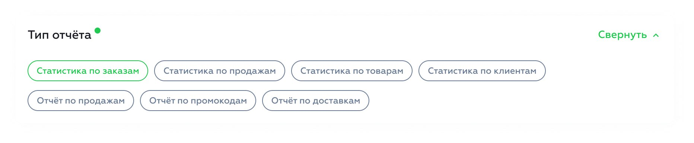

# Report Type Selection

The user selects the report type using this box:



To render this selector you will need to fetch some data from this endpoint:

Method: `GET`  
Endpoint: `/api/company/v2/dashboard/reports/orders/get-report-config`

As a result you will get this structure:

```Hack
shape(
    // All the possible report types
    'report_types' => array<string>,
    
    // Some additional configuration for each report type
    'extra_config' => array<
        // The report type as the key
        string,
        
        shape(
            // The `status` key describes whether this report type is
            // enabled (1) or disabled (0)
            'status' => 0 | 1,
            
            ...,
        )
    >,
    
    ...,
)
```

We will then need to render only the reports that are in the `report_types` array and the ones that have `status: 1`
in their `extra_config`.

For example, we will get a response like this:

```json5
{
  report_types: [
    'order_stats',
    'customer_stats',
    'item_stats',
  ],
  extra_config: {
    order_stats: {
      status: 1,
    },
    customer_stats: {
      status: 1,
    },
    item_stats: {
      status: 0,
    },
  },
}
```

For this particular example, we will render only the reports `order_stats` and `customer_stats`; because they're the
only ones that are enabled.
